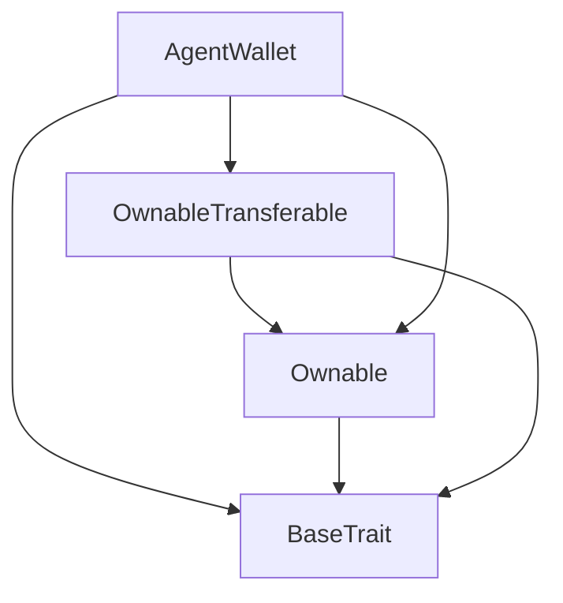
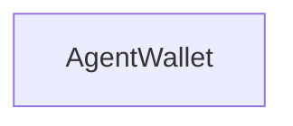

# Tact compilation report
Contract: AgentWallet
BoC Size: 1043 bytes

## Structures (Structs and Messages)
Total structures: 18

### DataSize
TL-B: `_ cells:int257 bits:int257 refs:int257 = DataSize`
Signature: `DataSize{cells:int257,bits:int257,refs:int257}`

### SignedBundle
TL-B: `_ signature:fixed_bytes64 signedData:remainder<slice> = SignedBundle`
Signature: `SignedBundle{signature:fixed_bytes64,signedData:remainder<slice>}`

### StateInit
TL-B: `_ code:^cell data:^cell = StateInit`
Signature: `StateInit{code:^cell,data:^cell}`

### Context
TL-B: `_ bounceable:bool sender:address value:int257 raw:^slice = Context`
Signature: `Context{bounceable:bool,sender:address,value:int257,raw:^slice}`

### SendParameters
TL-B: `_ mode:int257 body:Maybe ^cell code:Maybe ^cell data:Maybe ^cell value:int257 to:address bounce:bool = SendParameters`
Signature: `SendParameters{mode:int257,body:Maybe ^cell,code:Maybe ^cell,data:Maybe ^cell,value:int257,to:address,bounce:bool}`

### MessageParameters
TL-B: `_ mode:int257 body:Maybe ^cell value:int257 to:address bounce:bool = MessageParameters`
Signature: `MessageParameters{mode:int257,body:Maybe ^cell,value:int257,to:address,bounce:bool}`

### DeployParameters
TL-B: `_ mode:int257 body:Maybe ^cell value:int257 bounce:bool init:StateInit{code:^cell,data:^cell} = DeployParameters`
Signature: `DeployParameters{mode:int257,body:Maybe ^cell,value:int257,bounce:bool,init:StateInit{code:^cell,data:^cell}}`

### StdAddress
TL-B: `_ workchain:int8 address:uint256 = StdAddress`
Signature: `StdAddress{workchain:int8,address:uint256}`

### VarAddress
TL-B: `_ workchain:int32 address:^slice = VarAddress`
Signature: `VarAddress{workchain:int32,address:^slice}`

### BasechainAddress
TL-B: `_ hash:Maybe int257 = BasechainAddress`
Signature: `BasechainAddress{hash:Maybe int257}`

### ChangeOwner
TL-B: `change_owner#819dbe99 queryId:uint64 newOwner:address = ChangeOwner`
Signature: `ChangeOwner{queryId:uint64,newOwner:address}`

### ChangeOwnerOk
TL-B: `change_owner_ok#327b2b4a queryId:uint64 newOwner:address = ChangeOwnerOk`
Signature: `ChangeOwnerOk{queryId:uint64,newOwner:address}`

### AddAllowedAddress
TL-B: `add_allowed_address#00000001 address:address = AddAllowedAddress`
Signature: `AddAllowedAddress{address:address}`

### RemoveAllowedAddress
TL-B: `remove_allowed_address#00000002 address:address = RemoveAllowedAddress`
Signature: `RemoveAllowedAddress{address:address}`

### SetSpendingLimit
TL-B: `set_spending_limit#00000003 maxTransaction:coins dailyLimit:coins = SetSpendingLimit`
Signature: `SetSpendingLimit{maxTransaction:coins,dailyLimit:coins}`

### TransferTon
TL-B: `transfer_ton#00000004 to:address amount:coins = TransferTon`
Signature: `TransferTon{to:address,amount:coins}`

### PolicyInfo
TL-B: `_ maxTransaction:coins dailyLimit:coins spentToday:coins lastResetTime:uint32 = PolicyInfo`
Signature: `PolicyInfo{maxTransaction:coins,dailyLimit:coins,spentToday:coins,lastResetTime:uint32}`

### AgentWallet$Data
TL-B: `_ owner:address allowedAddresses:dict<address, bool> maxTransaction:coins dailyLimit:coins spentToday:coins lastResetTime:uint32 = AgentWallet`
Signature: `AgentWallet{owner:address,allowedAddresses:dict<address, bool>,maxTransaction:coins,dailyLimit:coins,spentToday:coins,lastResetTime:uint32}`

## Get methods
Total get methods: 4

## balance
No arguments

## isAllowed
Argument: addr

## policyInfo
No arguments

## owner
No arguments

## Exit codes
* 2: Stack underflow
* 3: Stack overflow
* 4: Integer overflow
* 5: Integer out of expected range
* 6: Invalid opcode
* 7: Type check error
* 8: Cell overflow
* 9: Cell underflow
* 10: Dictionary error
* 11: 'Unknown' error
* 12: Fatal error
* 13: Out of gas error
* 14: Virtualization error
* 32: Action list is invalid
* 33: Action list is too long
* 34: Action is invalid or not supported
* 35: Invalid source address in outbound message
* 36: Invalid destination address in outbound message
* 37: Not enough Toncoin
* 38: Not enough extra currencies
* 39: Outbound message does not fit into a cell after rewriting
* 40: Cannot process a message
* 41: Library reference is null
* 42: Library change action error
* 43: Exceeded maximum number of cells in the library or the maximum depth of the Merkle tree
* 50: Account state size exceeded limits
* 128: Null reference exception
* 129: Invalid serialization prefix
* 130: Invalid incoming message
* 131: Constraints error
* 132: Access denied
* 133: Contract stopped
* 134: Invalid argument
* 135: Code of a contract was not found
* 136: Invalid standard address
* 138: Not a basechain address
* 24704: Max transaction must be positive
* 28386: Daily spending limit exceeded
* 42435: Not authorized
* 45442: Daily limit must be positive
* 54615: Insufficient balance
* 60497: Exceeds max transaction limit
* 61135: Amount must be positive

## Trait inheritance diagram

## Contract dependency diagram

